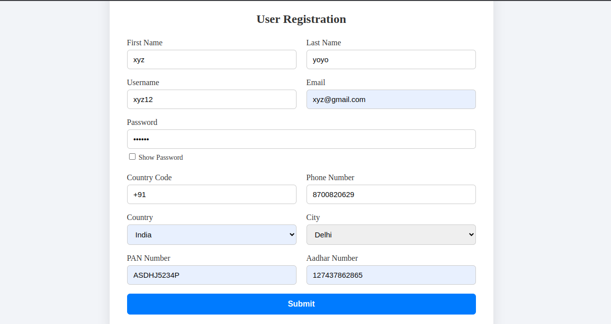
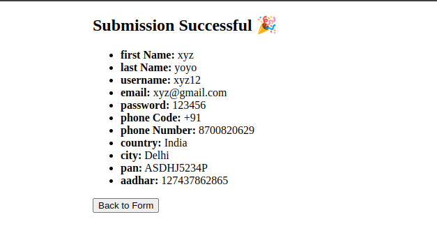

# 🧾 React Form with Custom Validation

A responsive React form with real-time validation and no third-party libraries.

## 🚀 Features

- Real-time input validation
- Inline error messages
- Submit button disabled until form is valid
- Password show/hide toggle
- Dynamic city options based on country
- Displays submitted data on a new route
---

## 📸 Preview

> You can add a screenshot here  
> 
> 

---

## 🧩 Tech Stack

- React (v19+)
- React Router DOM
- CSS (no frameworks)

## 📋 Fields Included

- First Name, Last Name, Username
- Email, Password
- Phone No. (Country Code + Number)
- Country, City (dropdowns)
- PAN No., Aadhar No.

## ▶️ Run Locally

```bash
git clone https://github.com/your-username/react-form-validation
cd react-form-validation
npm install
npm run dev
